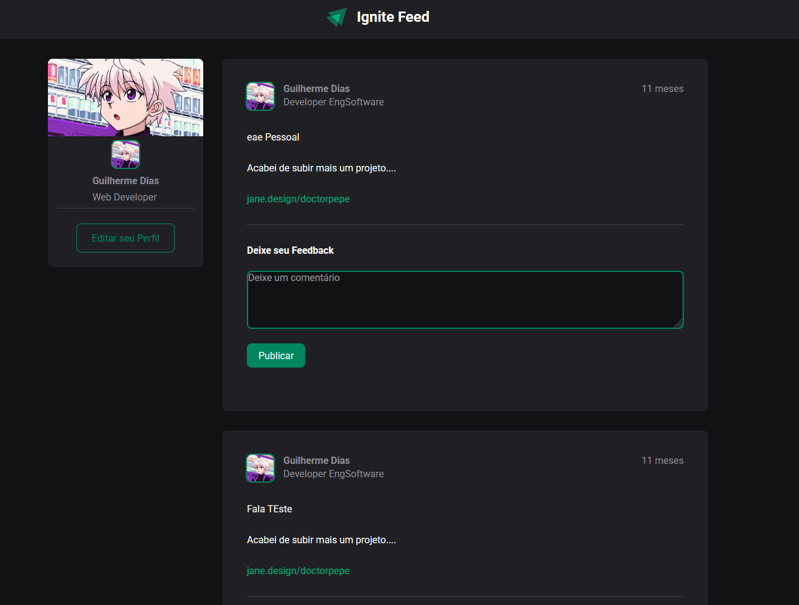

## Rede Social — React + Vite



### Visão geral
Projeto simples de uma página de rede social construído com React e Vite. O foco é nos princípios básicos do React: componentização, uso de `props` e gerenciamento de estado com `useState`.

### Tecnologias
- **React 18**
- **Vite** (desenvolvimento rápido com HMR)
- **ESLint** (regras básicas de qualidade)

### Conceitos React utilizados
- **Componentes**: divisão da interface em partes reutilizáveis
- **Props**: passagem de dados entre componentes
- **useState**: controle de estado local e atualização reativa

### Como executar
```bash
npm install
npm run dev
```
Abra o endereço mostrado no terminal (geralmente `http://localhost:5173`).

### Scripts
- **dev**: inicia o servidor de desenvolvimento
- **build**: gera a versão de produção
- **preview**: visualiza a build localmente
- **lint**: roda as verificações do ESLint

### Estrutura (simplificada)
- `public/` — ativos estáticos (ex.: `image.png`)
- `src/` — componentes e estilos da aplicação
